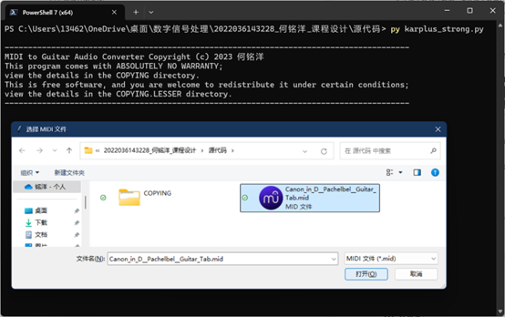
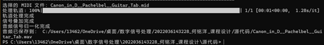

# **Table of Contents**

[**Project Introduction**](#Project-Introduction)

[**Function Description**](#Function-Description)

1. MIDI File Reading
2. Guitar Audio Generation
3. Audio Signal Merging and Saving

[**Operation Process**](#Operation-Process)

1. Install Dependencies
2. Run the Program
3. Select MIDI File
4. Generate Guitar Audio
5. Save Audio File

[**Input and Output Formats**](#Input-and-Output-Formats)

1. Input Format
2. Output Format

[**Notes**](#Notes)

1. File Path
2. Dependency Versions
3. Runtime Environment

# **Project Introduction**

MIDI to Guitar Audio Converter is a MIDI to guitar audio tool based on the Karplus-Strong algorithm. It can convert MIDI files into realistic guitar audio files by adjusting parameters such as sampling rate, decay factor, and harmonic time. It is suitable for music creation, education, and entertainment.

This project is developed in Python and provides corresponding debugging information during program execution for user convenience. It has been greatly optimized in terms of memory allocation and computation speed. No matter how large or complex the MIDI file is, it can be processed within 5 seconds.

# **Function Description**

## 1. MIDI File Reading

The project can read a single standard MIDI file at a time and parse the notes, rhythms, and other information.

## 2. Guitar Audio Generation

Using the Karplus-Strong algorithm, it generates corresponding guitar audio signals based on the notes, rhythms, and playing intensity in the MIDI file. During this process, the program outputs remaining time and other debugging information in the terminal, allowing users to know the processing progress and error information.

## 3. Audio Signal Merging and Saving

The generated guitar audio signals are merged and saved as a single-track WAV audio file.

# **Operation Process**

## 1. Install Dependencies

Ensure Python is installed (recommended version is Python 3.13.0 or above). Use pip to install the required Python dependencies, including mido, numpy, scipy, and tqdm. Pay attention to the versions of the dependencies. For details, see the development and runtime environment documentation.

## 2. Run the Program

Open the command line terminal (such as PowerShell) and navigate to the project directory.

Run the main program file (karplus_strong.py), and a file selection dialog will pop up.

## 3. Select MIDI File

In the file selection dialog, browse and select the MIDI file to be converted. The program will automatically read the file and parse the notes and rhythms of the tracks.

## 4. Generate Guitar Audio

The program will generate corresponding guitar audio signals using the Karplus-Strong algorithm based on the note information in the MIDI file. During the generation process, the program will display a progress bar and other information to indicate the processing progress.

## 5. Save Audio File

After generation is complete, the program will automatically merge the guitar audio signals into a single-track WAV audio file. It will then display the saved file path in the terminal and open the folder containing the file. By default, the generated audio file is saved in the same folder as the MIDI file.

# **Input and Output Formats**

## 1. Input Format

The project can only accept a single standard MIDI file as input at a time. The MIDI file should contain valid note and rhythm information. There is no size limit for the MIDI file. Multi-track non-solo MIDI files are allowed, but the generated effect cannot be guaranteed. It is highly recommended that the input MIDI file content be a single-track guitar solo for the best audio effect.

## 2. Output Format

The project saves the generated guitar audio signals as a single-track WAV audio file. The WAV file is a common audio file format that supports lossless audio compression and is widely used in various audio editing and playback software. If the input is a multi-track MIDI file, the multiple signals generated from the multiple tracks will be superimposed and merged into one signal, and finally a single-track audio file will be generated.

# **Notes**

## 1. File Path

Ensure that the selected MIDI file path is correct and the file is readable. If the file path is invalid or the file cannot be read, the program will prompt an error and exit.

## 2. Dependency Versions

Ensure that the installed dependency versions match the project requirements. If the versions do not match, it may cause the program to run incorrectly. For specific dependency versions, see the development and runtime environment documentation.

## 3. Runtime Environment

The project is recommended to run on the Windows operating system and requires the corresponding Python interpreter. When running on other operating systems, additional configuration and testing may be required.
