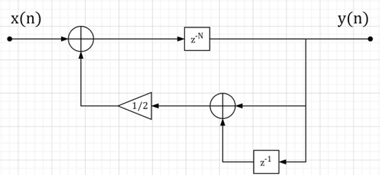
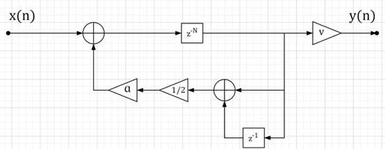
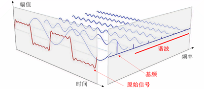
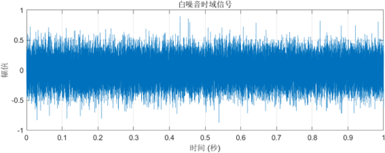
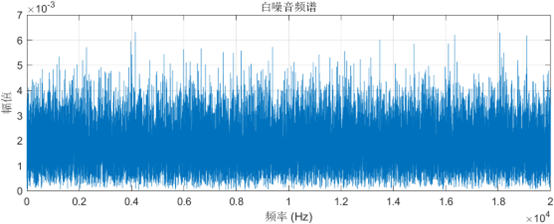
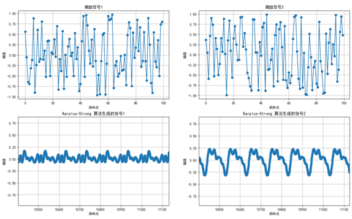
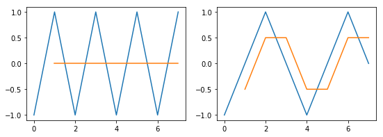
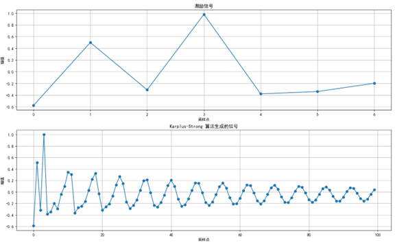

# **Table of Contents**

[**Basic Idea**](#Basic-Idea)

[**Working Principle**](#Working-Principle)

1. Excitation
2. Delay
3. Filtering
4. Looping

[**Mathematical Model**](#Mathematical-Model)

[**Pitch Control**](#Pitch-Control)

[**Extended Algorithm**](#Extended-Algorithm)

[**Some Details**](#Some-Details)

1. Understanding Fundamental Frequency and Harmonics
2. Why Choose White Noise?
3. Does It Have to Be White Noise?
4. How Much Impact Do Random Numbers Have?
5. Is Averaging a Low-Pass Filter?
6. Pole-Zero Distribution

[**References**](#References)

[**Appendix: Sample Code**](#Appendix-Sample-Code)

# **Basic Idea**

The Karplus-Strong algorithm is a physical modeling synthesis method that generates sound by simulating the vibration of a plucked string. It is based on two simple steps to simulate the vibration and decay of the string:

(1) Generate a random initial signal;

(2) Perform recursive averaging on the signal.

This technique can be seen as subtractive synthesis in a feedback loop with a comb filter; if the delay block storing the signal is viewed as a wavetable, it can also be considered the simplest form of wavetable transformation algorithm, i.e., "digital waveguide synthesis" [1].

# **Working Principle**

## 1. Excitation

Generate an excitation signal (initial signal) with a length of $N$ unit samples, where N is the length of the (approximate) required pitch period of the note in the sampling, which determines the fundamental frequency of the string sound. The value of $N$ is the number of sampling points in one pitch period, calculated as the ratio between the signal sampling rate (${f}_{s}$) and the note frequency ($f$), i.e.:

$$
N=\frac{f_{s}}{f}
$$

The value or content of this excitation signal adds initial randomness and naturalness to the string sound, determining the timbre of the final generated signal. In this project and the basic algorithm, random values, i.e., white noise, are used as the content of the excitation signal. The range of random values is [-1,1].

The sampling rate of this project is 44.1 KHz, which is also the sampling rate of CD quality. The human hearing range is 20 Hz ~ 20 KHz. According to Nyquist's Sampling Theorem, a sampling rate of 44.1 KHz can achieve distortion-free sampling. Kevin Karplus and Alex Strong stated in their paper [2] that the minimum sampling rate must be 28.6 KHz to cover the entire range of the guitar (up to about 880 Hz). I don't understand why the minimum value is this.

## 2. Delay

There are two delays here, in sequence, with the definition and value of $N$ being the same as in the "Excitation" section. It is recommended to refer to Figure 1:

The length of the first delay is $N$ unit samples;

The second delay is based on the first delay, adding 1 unit sample length, i.e., the length of the second delay is $N+1$ unit samples. Note that do not get confused by $z^{-N-1}$, thinking the length should be $N-1$ unit samples. Replacing $z^{-N-1}$ with $z^{-(N+1)}$ might be easier to understand.

The physical meaning of delay in this project is simple and can be easily understood by referring to Figure 1:

The first delay takes the signal content (output) from the previous period ($N$ samples ago) as the input signal for the current period;

The second delay, based on the first part, takes the signal from one unit sample before the previous period ($N+1$ samples ago) as the input signal for the current period.

## 3. Filtering

The delayed signal passes through a filter whose gain must be less than 1 at all frequencies to maintain the stability of the feedback loop. In this project and the basic algorithm, "filtering" is achieved by averaging the two delayed signals, which physically means averaging two adjacent samples. This implementation is simple, requiring only shifting and addition operations, without multiplication.

The characteristics of the filter determine the harmonic structure of the decayed tone. In this project and the basic algorithm, an $N$-order IIR direct-form digital filter (more precisely, a comb filter, which is essentially an IIR filter) is used to make the high-frequency components of the sound decay faster, similar to the decay of string vibrations. The filter structure flowchart is shown in Figure 1:


_Figure 1 Filter Structure Flowchart_

## 4. Looping

The sequence is continuously looped, allowing the new signal to pass through the filter again, simulating the natural decay of string vibrations. The number of loops is the product of the note frequency ($f$) and the sampling time ($t$) minus one, i.e.:

$$
f*t-1
$$

In this project, the sampling time is essentially the duration of the note, or the duration of the generated harmonics. The number of loops in the first second of a note's playback equals the note frequency minus one. After that, the number of loops per second equals the note frequency. If the playback lasts for two seconds, the sampling time is two, and the total number of loops is the note frequency multiplied by two minus one.

The subtraction of one is because the excitation signal occupies the first pitch period, and in this project, the excitation signal is not filtered in the first pitch period. This means that the content of the first pitch period of the generated signal is the excitation signal, and filtering starts from the second pitch period.

If the excitation signal is not included in the generated signal and filtering starts from the first pitch period, the number of loops equals the note frequency multiplied by the sampling time, i.e., $f*t$.

# **Mathematical Model**

(1) The difference equation of the filter can be expressed as:

$$
y(n)=\frac{y(n-N)+y(n-N-1)}{2}+x(n)
$$

The system difference equation can be expressed as:

$$
y(n)=\frac{\sum_{i=N}^{n-1}y(n-i)+\sum_{i=N}^{n-1}y(n-i-1)}{2}+\sum_{i=0}^{N-1}x(n)
$$

where $N$ is the (approximate) required pitch period of the note in the sampling. The definition of $x(n)$ is as follows:

$$
x(n)=\begin{cases}
u_{n}, & \quad n=0,1,2,...,N-1 \\
0, & \quad n\geq N
\end{cases}
$$

where ${u}_{n}\in [-1,1]$ is a random number.

(2) The system function can be expressed as:

$$
H(z)\triangleq\frac{Y(z)}{X(z)}=\frac{1}{1-\frac{1+z^{-1}}{2}z^{-N}}=\frac{1}{1-\frac{1}{2}z^{-N}-\frac{1}{2}z^{-(N+1)}}
$$

(3) The system frequency response function can be expressed as:

$$
H\left(e^{j\omega T_s}\right)=\frac{1}{1-\frac{1+e^{-j\omega T_s}}{2}e^{-j\omega NT_s}}=\frac{1}{1-e^{-\pi fT_s}\cos(\pi fT_s)e^{-j2\pi fNT_s}}
$$

where $`{T}_{s}`$ is the sampling period in seconds, which is the reciprocal of the sampling rate $`{f}_{s}`$.

# **Pitch Control**

By changing the length of the pitch period $N$, the fundamental frequency of the synthesized sound can be controlled, thereby achieving pitch control. Here $N\propto f$, where $f$ is the note frequency. For specific definitions and formulas, refer to the "1.2.1 Excitation" section.

# **Extended Algorithm**

The algorithm used in this project is a slight modification of the above basic algorithm, which can be considered a simple extended algorithm. The modification is to attenuate the signal after each filtering by multiplying it with a decay factor ($α$) to simulate the physical characteristic of energy decay over time. The final generated signal is multiplied by a note velocity factor ($v$) to adjust the amplitude of the signal, simulating the plucking strength when playing the guitar. The filter structure flowchart is shown in Figure 2:


_Figure 2 Filter Structure Flowchart_

The decay factor $\alpha \in (0,1]$ causes the overall signal (including harmonics) to decay exponentially. In this project, the value is 0.996. Due to exponential decay, the adjustment of the decay factor is done in units of 0.001 at most. Of course, in reality, the energy decay of the signal is not that simple. For different pitches, the decay factor needs to be dynamically adjusted to achieve better timbre effects.

The note velocity factor $v\in [0,1]$ proportionally scales the generated signal, adjusting the amplitude of the signal, which can be considered a gain adjustment. Its value comes from the MIDI score and is normalized.

The mathematical model of the extended algorithm in this project is not elaborated here.

# **Some Details**

## 1. Understanding Fundamental Frequency and Harmonics

**Fundamental Frequency**

(1) Definition: The fundamental frequency, also known as the fundamental pitch or base frequency, is the lowest frequency of a vibrating system. It is the lowest frequency component in a composite wave. For periodic signals, the fundamental frequency is the repetition rate of each cycle of the signal.

(2) Characteristics: The fundamental frequency determines the overall period length of the signal. For example, if the fundamental frequency of a signal is 100 Hz, the signal repeats 100 times per second, and each cycle lasts 1/100 seconds.

**Harmonics**

(1) Definition: Harmonics refer to the integer multiples of the fundamental frequency obtained by decomposing a periodic non-sinusoidal alternating quantity using Fourier series. In other words, harmonics are frequency components that are integer multiples of the fundamental frequency, forming the frequency spectrum of the signal.

(2) Characteristics: Harmonics include the fundamental frequency (the first harmonic) and its integer multiple frequency components. For example, if the fundamental frequency is F0, the second harmonic is 2F0, the third harmonic is 3F0, and so on. Harmonics play a role in beautifying the sound and adding color to the audio signal.

**Relationship Between the Two**

(1) Foundation and Derivation: The fundamental frequency is the lowest frequency harmonic in the signal and is the basis of all harmonic components. Without the fundamental frequency, harmonics would not exist.

(2) Constituting the Signal: The fundamental frequency and harmonics together form the frequency spectrum of the signal. In audio signals, the fundamental frequency determines the pitch of the sound, while harmonics determine the timbre and quality of the sound.

(3) Orthogonality: In Fourier transform, responses at different frequencies are independent (as shown in Figure 2). The fundamental frequency and harmonics satisfy orthogonality, meaning they do not interfere with each other and can be analyzed and processed independently.


_Figure 3 Fundamental Frequency and Harmonics (Fourier Transform) [3]_

**Differences Between the Two**

(1) Different Frequencies: The fundamental frequency is the lowest frequency component in the signal, while harmonics are integer multiple frequency components of the fundamental frequency.

(2) Different Roles: The fundamental frequency determines the overall period length and pitch of the signal, while harmonics determine the timbre and quality of the signal.

(3) Existence: The fundamental frequency is a necessary component of the signal, while harmonics may vary depending on the complexity and source of the signal.

## 2. Why Choose White Noise?

The reason for choosing white noise is that it has a very broad frequency spectrum. White noise is defined as random noise with constant signal intensity in the time domain (as shown in Figure 4); its power spectral density is equal in all frequency bands within a wide frequency range, and the spectral density is uniform across the entire frequency domain (as shown in Figure 5). Just as white light contains equal amounts of all colors in the spectrum, white noise contains equal amounts of all frequency components, and the intensity of each frequency component is the same.


_Figure 4 (Code in Appendix: SampleCode1.mlx)_


_Figure 5 (Code in Appendix: SampleCode1.mlx)_

Although the above explanation is very professional, I am still not satisfied because I still don't understand. At least for me, the explanation needs to go deeper. The following is a personal interpretation, which may be inaccurate or even completely wrong!

What does a broad frequency spectrum mean? It means that the signal or system can contain various frequency components, including the required fundamental frequency and its various harmonics. Therefore, white noise has a broad frequency spectrum, meaning that white noise pulses contain rich harmonics.

What does having rich harmonics mean? It means a lot for the Karplus-Strong algorithm because it needs rich harmonics to simulate "more" realistic instrument sounds. A tall building starts from the ground, and rich harmonics are the "ground"!

How does the Karplus-Strong algorithm achieve the above purpose through rich harmonics? The answer is through the filter! The filter selectively attenuates or removes harmonics that are integer multiples of the fundamental frequency. By choosing which harmonics to attenuate or remove and how quickly to attenuate them, various sound effects such as plucking and drumming can be achieved.

You read that right, the Karplus-Strong algorithm can be used to generate drum sounds. Kevin Karplus and Alex Strong mentioned this in their paper [2]. However, compared to drum sounds, the algorithm works better for generating plucked string sounds, so it is mainly used for string instruments (especially plucked instruments like guitars).

You may have noticed ~~(or not)~~ , why always add "rich" before harmonics? Is it necessary? Can "not rich" or very few harmonics work? Good question! The answer is yes.

First, when the harmonic components in the signal are relatively small or few, it means that the signal mainly consists of the fundamental frequency component, and the harmonic components have little impact on the overall signal. Such a signal may have a relatively pure timbre because harmonics usually add rich overtones and timbre characteristics to the signal. When the harmonic components are very small, the signal's timbre may be closer to that of a single sound source (such as a sine wave).

In music production that requires rich timbre, the lack of harmonic components may make the sound too monotonous and dull. This is easy to understand. For any filter, no matter how complex or simple its structure is, it first needs a "wave" to "filter." A clever housewife cannot cook without rice. Some may think (like me): there is still a fundamental frequency to "filter." Indeed, if there is no rice, eating dirt is also an option, haha. Joking aside, let's get serious. The filter in the Karplus-Strong algorithm is a low-pass filter without a cutoff frequency. The fundamental frequency is the lowest frequency in the composite wave, and this filter basically does not filter it (in terms of enriching the timbre). The main filtering targets are harmonics that are integer multiples of the fundamental frequency. The fundamental frequency cannot bear the responsibility of enriching the timbre. Therefore, harmonics need to be rich; if they are not rich or very few, they will not have much effect. A tall building starts from the ground. The flatter and more solid the ground, the taller the building.

Here, I want to remind you that the statement "the low-pass filter basically does not filter the fundamental frequency" in the previous paragraph is in terms of "enriching the timbre." If it is a low-pass filter with a cutoff frequency, it indeed does not filter the fundamental frequency (if the cutoff frequency is higher than the fundamental frequency). However, the low-pass filter in the Karplus-Strong algorithm is achieved by averaging the signal, which will average any frequency, including the fundamental frequency, and have a "filtering" effect. This is why in the Karplus-Strong algorithm, rich harmonics are used to simulate "more" realistic string instrument sounds. The real effect of simulating realistic string instrument sounds is achieved through the combination of the fundamental frequency and the filter. As for why "averaging can have a filtering effect," please refer to section 1.6.5 "Is Averaging a Low-Pass Filter?" for an explanation.

In practical applications, signals with very small or few harmonics mainly appear in pure sine wave signals. A sine wave is an ideal waveform that contains only a single frequency component and no harmonics. However, it is difficult to achieve a completely pure sine wave in practical applications, but signals close to a pure sine wave can be generated.

However, signals with very small or few harmonics have advantages in certain application scenarios. For example, in music production that requires a pure timbre, using signals with fewer harmonic components can achieve a clearer and purer timbre. This also has applications in guitar fingerstyle playing.

In guitar fingerstyle playing, there is a technique called "harmonics," which refers to plucking the string at specific positions such as the midpoint or one-third point, producing a very ethereal sound. The waveform of this ethereal sound is very close to a sine wave but not pure, as various factors cause many harmonics to exist. However, it is these harmonics that make the sound ethereal. The sound of a signal close to a pure sine wave is too monotonous and dull, which can be easily verified by generating it with software. The sound is only "empty" and not "ethereal" at all.

In summary, the presence of harmonics makes the sound more complex and diverse, capable of expressing more details and layers. Rich harmonic components make the generated signal's timbre closer to that of a real instrument, increasing the realism and expressiveness of the sound. This allows these sounds to be more delicate and rich in performance, better meeting the needs of music creation and sound design.

The above is the reason why the Karplus-Strong algorithm chooses white noise. In one sentence, using white noise in the algorithm is to better simulate the physical characteristics of string instruments. But this sentence sounds light and weightless, doesn't it?

## 3. Does It Have to Be White Noise?

It is not necessary to use white noise. Any signal with rich harmonics (such as a fast sine wave chirp or sweep, or a single-cycle sawtooth or square wave) can be used as an alternative [1]. For the reason, please refer to the role of rich harmonics in the previous section. However, in my experience, none of these alternatives sound as good as using white noise. Generally, white noise is used as the excitation signal to simulate guitar playing, which sounds the most realistic; at most, a sine wave chirp is used to simulate the "harmonics" technique in guitar fingerstyle playing. I have not found any other excitation signals that can be used in guitar playing.

The Chinese Wikipedia entry "Karplus-Strong String Synthesis" provides a segment of the Chinese folk song "Jasmine Flower" synthesized using the Karplus-Strong algorithm, intuitively demonstrating the impact of parameter adjustments on the sound. The first four phrases demonstrate the impact of different excitation signals on the timbre, with the selected excitation signals being pink noise, white noise, sine wave sweep, and single-cycle square wave, respectively. The last part shows the impact of filter cutoff frequency on the timbre by adjusting the filter frequency from low to high while keeping the excitation signal unchanged. You can listen to it.

## 4. How Much Impact Do Random Numbers Have?

The impact of random numbers on the algorithm can be summarized as follows:

(1) The use of random numbers in the Karplus-Strong algorithm is mainly to generate the initial white noise signal. If the random numbers are different, the generated white noise signal will also be different. However, due to subsequent algorithm processing (such as delay, filtering, and recursion), the initial signal will be modified and shaped, so the final generated sound may be similar, but the details (waveform) will still be different;


_Figure 6 (Code in Appendix: SampleCode2.py)_

(2) Different random numbers may affect the spectral characteristics of the initial signal, thereby affecting the timbre of the final generated sound to some extent. However, due to the human ear's tolerance for sound, this difference may not be easily noticeable;

(3) In practical applications, the generation and selection of random numbers can be determined based on specific needs and scenarios. If more precise simulation of the timbre of string instruments is required, more complex and refined random number generation algorithms may be needed to generate initial signals that are closer to real situations.

## 5. Is Averaging a Low-Pass Filter?

From a mathematical perspective, averaging a signal can be seen as integrating or weighted averaging the signal. This operation corresponds to the frequency response of a low-pass filter in the frequency domain. Specifically, when averaging a signal, high-frequency components, which change rapidly, will have their integral or weighted average values approach zero, while low-frequency components, which change slowly, will have their integral or weighted average values closer to their true values. Therefore, the process of averaging a signal exhibits the characteristics of a low-pass filter in the frequency domain.

If we average the sequence [-1,1,-1,1,-1,1,-1,1] before and after, we get [0,0,0,0,0,0,0]; if we average the sequence [-1,0,1,0,-1,0,1,0] before and after, we get [-0.5,0.5,0.5,-0.5,-0.5,0.5,0.5]. The results are shown in Figure 7.


_Figure 7 The Process of Averaging as a Low-Pass Filter [4]_

Obviously, the faster the change, the more the high-frequency components are attenuated.

The filtering effect of averaging a signal is mainly reflected in the following two aspects:

(1) Smoothing: Averaging a signal is essentially smoothing the signal in the time domain. This smoothing can remove short-term fluctuations and retain long-term trends, providing a smooth signal form (as shown in Figure 8).


_Figure 8 Filtering Effect (Code in Appendix: SampleCode3.py)_

(2) Suppressing High-Frequency Noise: In signal processing, high-frequency components often represent noise or interference. By averaging the signal, high-frequency noise can be suppressed, improving the signal-to-noise ratio. This is consistent with the function of a low-pass filter, which attenuates high-frequency signals and allows low-frequency signals to pass through.

## 6. Pole-Zero Distribution

Analyzing the mathematical model reveals that the function has no zeros. By plotting the pole-zero distribution for different pitch periods (as shown in Figure 9), it can be observed that regardless of the pitch period, there is always a pole on the unit circle; as the pitch period increases, the distribution of poles gets closer to the unit circle.


_Figure 9 (Code in Appendix: SampleCode4.mlx)_

# **References**

1. **2024.** 卡普拉斯-斯特朗弦乐合成. 维基百科. [联机] 2024年1月10日. [引用日期: 2024年11月7日.] [https://zh.wikipedia.org/wiki/%E5%8D%A1%E6%99%AE%E6%8B%89%E6%96%AF-%E6%96%AF%E7%89%B9%E6%9C%97%E5%BC%A6%E4%B9%90%E5%90%88%E6%88%90](https://zh.wikipedia.org/wiki/%E5%8D%A1%E6%99%AE%E6%8B%89%E6%96%AF-%E6%96%AF%E7%89%B9%E6%9C%97%E5%BC%A6%E4%B9%90%E5%90%88%E6%88%90).
2. **Karplus, Kevin and Strong, Alex. 1983.** Digital Synthesis of Plucked String and Drum Timbres. *Computer Music Journal.* 1983, Vol. 7, 2, pp. 43-55.
3. **BhatiaAatish. 2013.** The Math Trick Behind MP3s, JPEGs, and Homer Simpson's Face. Nautil. [联机] 2013年11月6日. [引用日期: 2024年11月10日.] [http://nautil.us/blog/the-math-trick-behind-mp3s-jpegs-and-homer-simpsons-face.](http://nautil.us/blog/the-math-trick-behind-mp3s-jpegs-and-homer-simpsons-face.)
4. **李美哲. 2019.** Karplus-Strong算法：初探声音的物理建模合成（附Python实现）. 知乎. [联机] 2019年11月20日. [引用日期: 2024年11月101日.] [https://zhuanlan.zhihu.com/p/92577332.](https://zhuanlan.zhihu.com/p/92577332.)

# **Appendix: Sample Code**

## SampleCode1.mlx

```matlab
% MATLAB R2024a
% 设置参数
Fs = 40000;          % 采样频率 (Hz)
T = 1;               % 信号持续时间 (秒)
N = Fs * T;          % 采样点数

% 生成白噪音
white_noise = randn(N, 1);

% 将白噪音缩放到合适的范围（例如，-1 到 1）
white_noise = white_noise / max(abs(white_noise)) * 0.9; % 留出一些余量以避免削波

% 绘制时域信号
time = (0:N-1) / Fs;
figure;
subplot(2,1,1);
plot(time, white_noise);
title('白噪音时域信号');
xlabel('时间 (秒)');
ylabel('幅值');
grid on;

% 计算频谱
Y = fft(white_noise);
P2 = abs(Y/N);
P1 = P2(1:N/2+1);
P1(2:end-1) = 2*P1(2:end-1);

% 频率轴
f = Fs*(0:(N/2))/N;

% 绘制频谱图
subplot(2,1,2);
plot(f, P1);
title('白噪音频谱');
xlabel('频率 (Hz)');
ylabel('幅值');
grid on;
```

## SampleCode2.py

```python
import matplotlib
import matplotlib.pyplot as plt
import numpy as np

# 设置全局字体为 SimHei
matplotlib.rcParams["font.sans-serif"] = ["SimHei"]
matplotlib.rcParams["axes.unicode_minus"] = False


def karplus_strong(sampling_rate, frequency, harmonic_time):
    """
    使用 Karplus-Strong 算法生成音频信号

    参数:
    sampling_rate (int): 采样率
    pitch (int): 音高
    harmonic_time (float): 泛音持续时间，单位为秒

    返回:
    output_signal (numpy.array): 生成的音频信号
    fundamental_sound (list): 初始激励信号（基音）
    """

    # 计算周期长度
    period_length = max(round(sampling_rate / frequency), 1)
    harmonic_time = max(harmonic_time, 0.1)
    # 计算总采样点数
    count = max(round(sampling_rate * harmonic_time), 1)
    # 初始化输出数组为0
    output_signal = np.zeros(count)

    # 为第一个周期生成初始激励信号（白噪音）
    fundamental_sound = 2 * np.random.rand(period_length) - 1
    output_signal[:period_length] = fundamental_sound

    # 从第二个周期开始，迭代计算每个采样点的值
    for i in range(period_length, count):
        delay = i - period_length
        output_signal[i] = (output_signal[delay] + output_signal[delay - 1]) * 0.5
    return output_signal, fundamental_sound.tolist()


# 设置参数
SamplingRate = 44100  # 采样率
Frequency = 440  # 音符的频率
HarmonicTime = 1  # 泛音持续时长
# 计算输出信号和初始激励信号
OutSignal, InitialSignal = karplus_strong(SamplingRate, Frequency, HarmonicTime)
OutSignal1, InitialSignal1 = karplus_strong(SamplingRate, Frequency, HarmonicTime)
# 归一化输出信号
OutSignal /= np.max(np.abs(OutSignal))
OutSignal1 /= np.max(np.abs(OutSignal1))

# 创建一个包含两个子图的图形
fig, axs = plt.subplots(2, 2)
# 绘制初始样本值
axs[0, 0].plot(InitialSignal, marker="o", linestyle="-", label="激励信号")
axs[0, 0].set_title("激励信号1")
axs[0, 0].set_xlabel("采样点")
axs[0, 0].set_ylabel("幅值")
axs[0, 0].grid(True)
# axs[0, 0].legend()

axs[0, 1].plot(InitialSignal1, marker="o", linestyle="-", label="激励信号")
axs[0, 1].set_title("激励信号2")
axs[0, 1].set_xlabel("采样点")
axs[0, 1].set_ylabel("幅值")
axs[0, 1].grid(True)
# axs[0, 1].legend()

# 绘制最终输出数组
axs[1, 0].plot(OutSignal, marker="o", linestyle="-", label="最终输出值")
axs[1, 0].set_title("Karplus-Strong 算法生成的信号1")
axs[1, 0].set_xlabel("采样点")
axs[1, 0].set_ylabel("幅值")
axs[1, 0].grid(True)
# axs[1, 0].legend()

axs[1, 1].plot(OutSignal1, marker="o", linestyle="-", label="最终输出值")
axs[1, 1].set_title("Karplus-Strong 算法生成的信号2")
axs[1, 1].set_xlabel("采样点")
axs[1, 1].set_ylabel("幅值")
axs[1, 1].grid(True)
# axs[1, 1].legend()

# 显示图形
plt.show()
```

## SampleCode3.py

```python
import matplotlib
import matplotlib.pyplot as plt
import numpy as np

# 设置全局字体为 SimHei
matplotlib.rcParams["font.sans-serif"] = ["SimHei"]
matplotlib.rcParams["axes.unicode_minus"] = False


def karplus_strong(sampling_rate, frequency, harmonic_time):
    """
    使用 Karplus-Strong 算法生成音频信号

    参数:
    sampling_rate (int): 采样率
    pitch (int): 音高
    harmonic_time (float): 泛音持续时间，单位为秒

    返回:
    output_signal (numpy.array): 生成的音频信号
    fundamental_sound (list): 初始激励信号（基音）
    """

    # 计算周期长度
    period_length = max(round(sampling_rate / frequency), 1)
    harmonic_time = max(harmonic_time, 0.1)
    # 计算总采样点数
    count = max(round(sampling_rate * harmonic_time), 1)
    # 初始化输出数组为0
    output_signal = np.zeros(count)

    # 为第一个周期生成初始激励信号（白噪音）
    fundamental_sound = 2 * np.random.rand(period_length) - 1
    output_signal[:period_length] = fundamental_sound

    # 从第二个周期开始，迭代计算每个采样点的值
    for i in range(period_length, count):
        delay = i - period_length
        output_signal[i] = (output_signal[delay] + output_signal[delay - 1]) * 0.5
    return output_signal, fundamental_sound.tolist()


# 设置参数
SamplingRate = 100  # 采样率
Frequency = 15  # 音符的频率
HarmonicTime = 1  # 泛音持续时长
# 计算输出信号和初始激励信号
OutSignal, InitialSignal = karplus_strong(SamplingRate, Frequency, HarmonicTime)
# 归一化输出信号
OutSignal /= np.max(np.abs(OutSignal))

# 创建一个包含两个子图的图形
fig, axs = plt.subplots(2, 1)
# 绘制初始样本值
axs[0].plot(InitialSignal, marker="o", linestyle="-", label="激励信号")
axs[0].set_title("激励信号")
axs[0].set_xlabel("采样点")
axs[0].set_ylabel("幅值")
axs[0].grid(True)
# 绘制最终输出数组
axs[1].plot(OutSignal, marker="o", linestyle="-", label="最终输出值")
axs[1].set_title("Karplus-Strong 算法生成的信号")
axs[1].set_xlabel("采样点")
axs[1].set_ylabel("幅值")
axs[1].grid(True)
# 显示图形
plt.show()
```

## SampleCode4.mlx

```matlab
% MATLAB R2024a
% 绘制系统的零极点分布图
N = 3;
B = [1, zeros(1,N)];
A = [1, zeros(1, N-1), -0.5, -0.5];
subplot(3,1,1)
zplane(B, A), grid on
legend('零点','极点')
title(['零极点分布图（音高周期N=', num2str(N), '）']);

N = 10;
B = [1, zeros(1,N)];
A = [1, zeros(1, N-1), -0.5, -0.5];
subplot(3,1,2)
zplane(B, A), grid on
legend('零点','极点')
title(['零极点分布图（音高周期N=', num2str(N), '）']);

N = 30;
B = [1, zeros(1,N)];
A = [1, zeros(1, N-1), -0.5, -0.5];
subplot(3,1,3)
zplane(B, A), grid on
legend('零点','极点')
title(['零极点分布图（音高周期N=', num2str(N), '）']);

% % 绘制系统的单位脉冲响应
% subplot(4,1,2)
% impz(B, A, 44100), grid on
% 
% % 绘制系统的频率响应曲线
% [H,w]=freqz(B,A,400,'whole');
% Hm=abs(H); 
% Hp=angle(H);
% subplot(4,1,3)
% plot(w,Hm), grid on
% xlabel('\omega(rad/s)'),ylabel('Magnitude')
% title(['离散系统幅频特性曲线（音高周期N=', num2str(N), '）']);
% subplot(4,1,4)
% plot(w,Hp), grid on
% xlabel('\omega(rad/s)'),ylabel('Phase')
% title(['离散系统相频特性曲线（音高周期N=', num2str(N), '）']);
```
