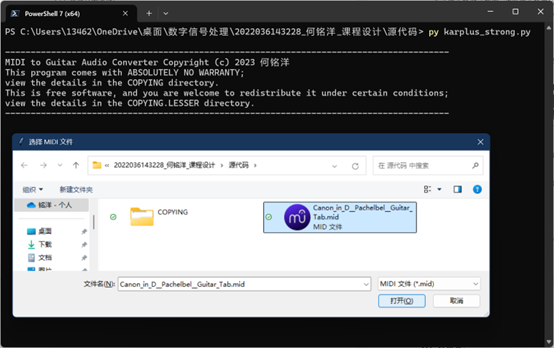
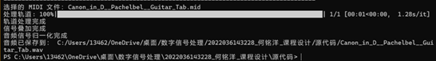

# **目录**

[**一、项目简介**](#一项目简介)

[**二、功能描述**](#二功能描述)

1. MIDI 文件读取
2. 吉他音频生成
3. 音频信号合并与保存

[**三、操作流程**](#三操作流程)

1. 安装依赖库
2. 运行程序
3. 选择 MIDI 文件
4. 生成吉他音频
5. 保存音频文件

[**四、输入输出格式**](#四输入输出格式)

1. 输入格式
2. 输出格式

[**五、注意事项**](#五注意事项)

1. 文件路径
2. 依赖库版本
3. 运行环境

# **一、项目简介**

MIDI to Guitar Audio Converter 是一个基于 Karplus-Strong 算法实现的 MIDI 转吉他音频工具。它能够通过调整采样率、衰减因子和谐波时间等参数，将 MIDI 文件转换为逼真的吉他音频文件，适用于音乐创作、教育及娱乐等领域。

本项目采用 Python 语言开发，并在程序运行中提供了相应的调试信息以方便用户使用；同时在内存分配、运算速度等方面上做了很大优化，可以毫不谦虚地说道，无论多大多复杂的 MIDI 文件，基本都可以在 5 秒内完成处理。

# **二、功能描述**

## 1. MIDI 文件读取

项目一次能够读取单个标准的 MIDI 文件，并解析其中的音符、节奏等信息。

## 2. 吉他音频生成

利用 Karplus-Strong 算法，根据 MIDI 文件中的音符、节奏、弹奏力度等信息生成对应的吉他音频信号。期间程序会在运行终端输出剩余时间等调试信息，方便用户知道程序处理进度及错误信息等。

## 3. 音频信号合并与保存

将生成的吉他音频信号进行合并，并保存为 WAV 格式的单轨道音频文件。

# **三、操作流程**

## 1. 安装依赖库

确保已安装 Python（建议版本为 Python 3.13.0 或以上）；使用 pip 安装所需的 Python 依赖库，包括 mido、numpy、scipy 和 tqdm 等。注意依赖库的版本，详细请见开发环境与运行环境文档。

## 2. 运行程序

打开命令行终端（如 PowerShell ），导航到项目目录。

运行程序主文件（ karplus_strong.py ），程序将弹出文件选择对话框。

## 3. 选择 MIDI 文件

在文件选择对话框中，浏览并选择要转换的 MIDI 文件。程序将自动读取该文件，并解析其中轨道的音符和节奏等信息。

## 4. 生成吉他音频

程序将根据 MIDI 文件中的音符信息，利用 Karplus-Strong 算法生成对应的吉他音频信号。在生成过程中，程序将显示进度条等信息以指示处理进度。

## 5. 保存音频文件

生成完成后，程序将自动将吉他音频信号合并为一个 WAV 格式的单轨道音频文件。之后在终端显示保存的文件路径，并打开该文件所在的文件夹。默认将生成的音频文件保存在与 MIDI 文件相同的文件夹中。

# **四、输入输出格式**

## 1. 输入格式

项目一次只能接受单个标准的 MIDI 文件作为输入。MIDI 文件应包含有效的音符和节奏信息。MIDI 文件的大小不受限制。允许输入多轨道非独奏的 MIDI 文件，但生成效果无法保证。十分建议输入的 MIDI 文件内容为单轨道吉他独奏，这样生成的音频效果最好。

## 2. 输出格式

项目将生成的吉他音频信号保存为WAV格式的单轨道音频文件。WAV 文件是一种常见的音频文件格式，支持无损音频压缩，并广泛应用于各种音频编辑和播放软件中。如果输入的是多轨道 MIDI 文件，会将多个轨道对应生成的多个信号叠加合并为一个信号，最终生成单轨道音频文件。

# **五、注意事项**

## 1. 文件路径

请确保选择的 MIDI 文件路径正确且文件可读。如果文件路径无效或文件无法读取，程序将提示错误并退出。

## 2. 依赖库版本

请确保已安装的依赖库版本与项目要求相匹配。如果版本不匹配，可能会导致程序运行出错。具体的依赖库版本详见开发环境与运行环境文档。

## 3. 运行环境

项目建议在 Windows 操作系统上运行，并需要相应的 Python 解释器。在其他操作系统上运行时，可能需要进行额外的配置和测试。
