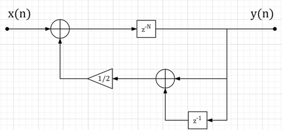
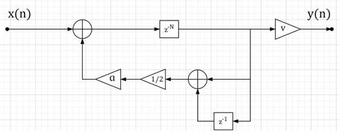
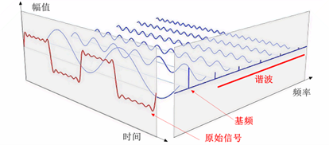
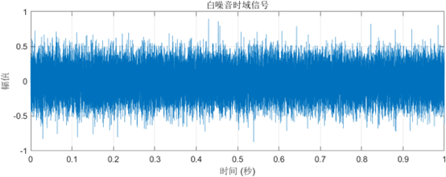
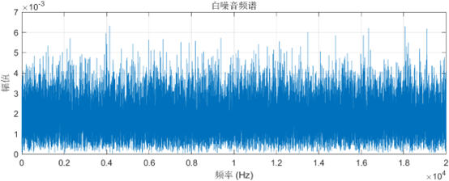
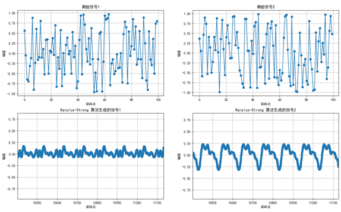
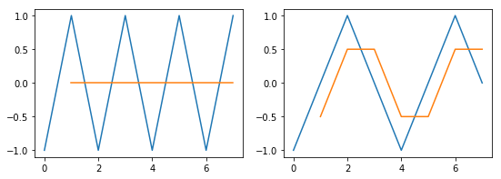
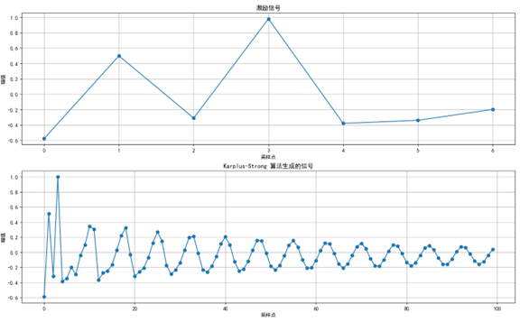
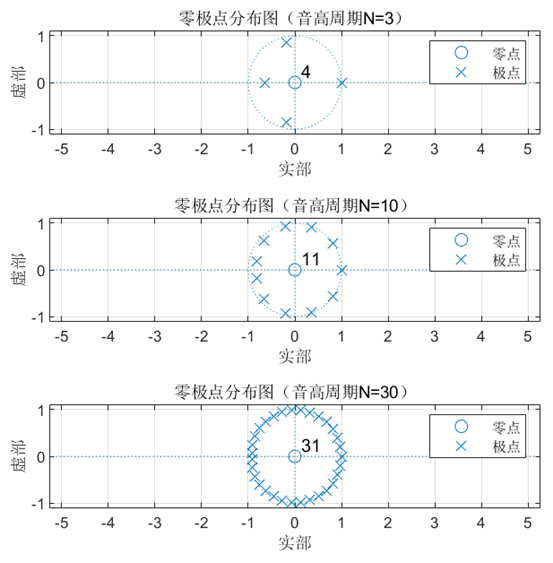

# **目录**

[**基本思想**](#基本思想)

[**工作原理**](#工作原理)

1. 激励
2. 延迟
3. 滤波
4. 循环

[**数学模型**](#数学模型)

[**音高控制**](#音高控制)

[**扩展算法**](#扩展算法)

[**一些细节**](#一些细节)

1. 了解下基频和谐波
2. 为什么选择白噪声？
3. 一定要是白噪声吗？
4. 随机数有多大影响？
5. 求平均是低通滤波？
6. 零极点分布

[**参考文献**](#参考文献)

[**附录：示例代码**](#附录示例代码)

# **基本思想**

Karplus-Strong 算法是一种物理建模合成方法，通过模拟拨动琴弦后的振动来生成声音。它基于两个简单的步骤以模拟琴弦的振动和衰减：

（1）生成随机初始信号；

（2）对信号进行递归平均处理。

这种技术可以看作是在一个有梳状滤波器的反馈回路进行减法合成；如果将存储信号的延迟块视作波表的话，也可以被看作是最简单的一类波表变换算法，即 “数字波导合成” [1] 。

# **工作原理**

## 1. 激励

生成一个长度为 $N$ 个单位样本长度的激励信号（初始信号），其中N是采样中音符的（近似）所需音高周期的长度，它决定了弦音的基频。$N$ 的值为一个音高周期内的采样点数，计算方法为信号采样率（ ${f}_{s}$ ）与音符频率（ $f$ ）之间的比值,即：

$$
N=\frac{f_{s}}{f}
$$

这个激励信号的值，或者说内容，增加弦音的初始随机性和自然感，决定了最终生成信号的音色。本项目算法及基本算法中使用的都是生成随机值，即白噪声，来作为激励信号的内容。随机值的取值范围为 [-1,1] 。

本项目的采样率为 44.1 KHz，这也是日常所说的 CD 音质的采样率。人的听觉范围是 20 Hz ~ 20 KHz，根据奈奎斯特采样定理（Nyquist’s Sampling Thereom），44.1 KHz 的采样率已经完全可以做到不失真采样。Kevin Karplus 和 Alex Strong 在论文 [2] 中给出采样率的最低值须为 28.6 KHz，才能覆盖吉他的整个声域范围（最高约 880 Hz）。至于为什么最低值是这个，我研究不明白。

## 2. 延迟

这里延迟有两次，注意有先后顺序， $N$ 的定义和取值与上一小结“激励”中的 “ $N$ ” 相同。建议结合图 1 去看：

第一次延迟的长度为 $N$ 个单位样本长度；

第二次延迟是在第一次延迟的基础上，再加上 1 个单位样本长度，即第二次延迟的长度为 $N+1$ 个单位样本长度。注意这里不要因为 $z^{-N-1}$ 而搞混了，认为长度应为 $N-1$ 个单位样本长度，把 $z^{-N-1}$ 换成 $z^{-(N+1)}$ 或许不容易弄错。

延迟在本项目中的物理意义很简单，结合图 1 去看会很好理解：

第一次延迟就是把上一个周期（ $N$ 个样本之前）的信号内容（输出）作为当前周期的输入信号；

第二次延迟是在上一部分的基础上，再取信号的前一个单位样本作为当前周期的输入信号，即把上一个周期（ $N+1$ 个样本之前）的信号内容（输出）的前一个单位样本作为当前周期的输入信号。

## 3. 滤波

延迟后的信号会通过一个滤波器，该滤波器的增益在所有频率下都必须小于 1，以保持反馈环路的稳定。在本项目和基本算法中，“滤波”是通过对两个延迟后的信号求和再平均实现的，物理意义上就是对两个相邻样本求平均。这种实现很简单，仅需要移位和加法运算，无需乘法。

滤波器的特性决定了衰减后音调的谐波结构，本项目和基本算法的实现都是用一个 $N$ 阶 IIR 直接型数字滤波器（再准确些，就是梳状滤波器，其本质也是一种 IIR 滤波器），来使声音的高频分量更快地损失，与弦振动的衰减情况相似。该滤波器结构流图见图1：

_图 1 滤波器结构流图_

## 4. 循环

将序列不断循环播放，使新信号再次通过滤波，以此来模拟琴弦振动的自然衰减。循环的次数为音符频率（ $f$ ）与采样时间（ $t$ ）的积减一，即：

$$
f*t-1
$$

这里采样时间在本项目中本质就是音符的持续时间，或者叫泛音持续时长、生成谐波时长之类的也没问题。一个音符播放的第一秒的循环次数等于音符频率值减一，之后每秒的循环次数等于音符频率值；如果播放两秒，那么采样时间就为二，总循环次数就为音符频率值乘以二再减一了。

减一则是因为激励信号占用了第一个音高周期，且在本项目中该激励信号在第一音高周期并未进行滤波，也就是说生成的信号的第一音高周期内容就是激励信号，滤波是从第二个音高周期开始。

如果激励信号不包含于生成的信号，滤波从第一音高周期就开始了，那么循环的次数则等于音符频率值乘以采样时间，即： $f*t$ 。

# **数学模型**

（1）滤波器差分方程可以表示为：

$$
y(n)=\frac{y(n-N)+y(n-N-1)}{2}+x(n)
$$

系统差分方程可以表示为：

$$
y(n)=\frac{\sum_{i=N}^{n-1}y(n-i)+\sum_{i=N}^{n-1}y(n-i-1)}{2}+\sum_{i=0}^{N-1}x(n)
$$

其中， $N$ 是采样中音符的（近似）所需音高周期。 $x(n)$ 的定义如下：

$$
x(n)=\begin{cases}
u_{n}, & \quad n=0,1,2,...,N-1 \\
0, & \quad n\geq N
\end{cases}
$$

其中， ${u}_{n}\in [-1,1]$ 是随机数。

（2）系统函数可以表示为：

$$
H(z)\triangleq\frac{Y(z)}{X(z)}=\frac{1}{1-\frac{1+z^{-1}}{2}z^{-N}}=\frac{1}{1-\frac{1}{2}z^{-N}-\frac{1}{2}z^{-(N+1)}}
$$

（3）系统频率响应函数可以表示为：

$$
H\left(e^{j\omega T_s}\right)=\frac{1}{1-\frac{1+e^{-j\omega T_s}}{2}e^{-j\omega NT_s}}=\frac{1}{1-e^{-\pi fT_s}\cos(\pi fT_s)e^{-j2\pi fNT_s}}
$$

其中， $`{T}_{s}`$ 是采样周期，单位为秒，其值为采样率 $`{f}_{s}`$ 的倒数。

# **音高控制**

通过改变音高周期的长度 $N$，可以控制合成声音的基频，从而实现控制音高。这里 $N\propto f$ ，其中 $f$ 是音符频率。具体的定义和公式等参见 “1.2.1 激励” 小结。

# **扩展算法**

本项目所用算法是在以上基本算法经过小小修改而来，可以算是一个简单的扩展算法。修改内容为在信号每次经过滤波后进行衰减，即乘上一个衰减因子（ $α$ ），以此来模拟物理上时域能量呈现不断衰减的特性；生成的信号最后会整体乘上一个音符力度因子（ $v$ ）来调整信号的幅值，以此来模拟物理上弹奏吉他时的弹拨力度。滤波器结构流图如图2：

_图 2 滤波器结构流图_

衰减因子 $\alpha \in (0,1]$ 使得整体信号（包括泛音）进行指数级衰减，本项目取值为 0.996 。由于是指数级衰减，对衰减因子的调节是最高以 0.001 为单位进行调节的。当然现实中信号的能量衰减不是这么简单，对于不同的音高衰减因子还需要动态调节以达到更好的声色效果。

音符力度因子 $v\in [0,1]$ 会对生成的信号等比例缩小或放大或不变、调整信号的幅值，算是对信号的增益。其取值来自 MIDI 谱，并对其进行归一化操作。

本项目扩展算法的数学模型不在此赘述。

# **一些细节**

## 1. 了解下基频和谐波

**基频**

（1）定义：基频，又称基波频率或基本频率，是自由振荡系统的最低振荡频率，也是复合波中的最低频率。对于周期性信号而言，基频是信号中每个周期的重复频率。

（2）特性：基频决定了信号的整体周期长度。例如，如果一个信号的基频是 100 Hz，那么该信号每秒重复 100 次，每个周期的时长为 1/100 秒。

**谐波**

（1）定义：谐波是指对周期性非正弦交流量进行傅里叶级数分解所得到的大于基波频率整数倍的各次分量。换句话说，谐波是基频的整数倍频率成分，它们构成了信号的频率谱。

（2）特性：谐波包括基频（第一个谐波）和其整数倍频率的成分。例如，如果基频是 F0，第二谐波是 2F0，第三谐波是3F0，依此类推。谐波在音频信号中起到美化声音、赋予色彩的作用。

**二者间的关系**

（1）基础与派生：基频是信号中最低频率的谐波，是所有谐波成分的基础。没有基频，就不会有谐波的存在。

（2）构成信号：基频和谐波共同构成了信号的频谱。在音频信号中，基频决定了声音的音调，而谐波则决定了声音的音色和音质。

（3）正交性：在傅里叶变换中，不同频率的响应是独立的（如图2）。基频和谐波之间满足正交性，这意味着它们不会相互干扰，可以独立地进行分析和处理。

_图 3 基频与谐波（傅里叶变换）[3]_

**二者间的区别**

（1）频率不同：基频是信号中频率最低的成分，而谐波则是基频的整数倍频率成分。

（2）作用不同：基频决定了信号的整体周期长度和音调，而谐波则决定了信号的音色和音质。

（3）存在性：基频是信号中必须存在的成分，而谐波则可能根据信号的复杂性和来源而有所不同。

## 2. 为什么选择白噪声？

之所以选择是因为白噪声拥有十分宽阔的频谱范围。白噪声的定义就是在时域上信号强度恒定的随机噪声（如图 4）；其在较宽的频率范围内，各等带宽的频带所含的噪声功率谱密度相等，频谱密度在整个频域内是均匀的（如图 5）。与白光在光谱中包含相同数量的所有颜色一样，白噪声包含相同数量的所有频率成分，并且每个频率成分的强度都相同。

_图 4 （代码见附录：SampleCode1.mlx）_

_图 5 （代码见附录：SampleCode1.mlx）_

虽然以上解释很专业，但我仍然不满足，因为我还是不懂。至少对于我来说，解释还需要再深入。以下是夹带私货的部分，解释或许不准确甚至全错！

宽阔的频谱范围意味着什么？意味着信号或系统能够包含多种不同频率的成分，这些成分包括所需的基频及其各种谐波。所以白噪声有宽阔的频谱范围，意味着白噪声脉冲含有丰富的谐波。

有丰富的谐波又意味着什么呢？对 Karplus-Strong 算法意味就大了，因为它需要丰富的谐波来模拟“更加”真实的乐器声音。万丈高楼平地起，丰富的谐波就是那个“平地”！

那么 Karplus-Strong 算法又是怎么通过丰富的谐波来达到以上目的呢？答案是通过滤波器！滤波器通过对这些频率是基频整数倍的谐波进行选择性衰减或剔除。通过选择哪些频率的谐波要衰减或剔除、衰减要多快等各种各样的组合，实现特定的音效如拨弦声、击鼓声等。

你没看错，Karplus-Strong 算法可以用于生成击鼓声，Kevin Karplus 和 Alex Strong 在论文 [2] 中有写到过。不过相比击鼓声，该算法在生成拨弦声上效果更好，因此主要用在弦乐（尤其是需要弹拨的乐器，如吉他）的生成上。

你或许注意到了~~（没有注意到）~~，为什么总是在谐波前面加上 “丰富的” 三个字？没有行不行？ “不丰富” 或很少行不行？好问题！答案是可以的。

首先，当信号中的谐波成分相对较小或数量较少时，这意味着信号主要由基频成分构成，而谐波成分对信号的整体影响较小。这样的信号可能具有较为纯净的音色，因为谐波通常会给信号增添丰富的泛音和音色特征。当谐波成分很小时，信号的音色可能更加接近单一声源（如正弦波）的音色。

在需要丰富音色的音乐制作中，缺乏谐波成分可能导致声音听起来过于单调和乏味。这很好理解，无论对于什么滤波器来说，不管结构多复杂也好，多简单也罢，它首先要有 “波” 可“滤”。巧妇难为无米之炊嘛。有人可能（比如我）会想：这不还有一个基频可以 “滤” 嘛。确实，没有米可以吃，吃土也行哈哈哈哈。皮一下，回归正经。Karplus-Strong 算法中的滤波器是一个不设置截止频率的低通滤波器，基频是复合波中的最低频率，该滤波器基本不对它过滤（特指丰富音色方面），过滤的主要就是“频率是基频整数倍”的谐波。基频无法承担起丰富音色的重任。因此，谐波要丰富，不丰富或很少起不了多大效果。万丈高楼平地起。要有平地，地越平越夯实，楼越高。

这里要提醒一下，上一段文字中提到的“低通滤波器基本不对基频过滤”是对于“丰富音色方面”而言的。如果是通过设置截止频率实现的低通滤波器确实是基本不对基频过滤（截止频率高于基频）。但 Karplus-Strong 算法中的低通滤波器是通过对信号求平均实现的，它会对任何频率包括基频在内的波（信号）进行求平均，都起到“过滤”的效果。这也是在Karplus-Strong 算法中，为什么丰富的谐波是用来模拟“更加”真实的弦乐器声音，真正起到模拟真实弦乐器声音作用的是通过基频加滤波器的组合。至于为什么“求平均能起到过滤效果”？请参考 1.6.5 小结 “求平均就是低通滤波？” 的解释。

在实际应用中，谐波很小或很少的信号主要出现在纯净正弦波信号中。正弦波是一种理想的波形，只包含单一频率成分，没有谐波。不过在实际应用中完全纯净的正弦波很难实现，但可以产生接近纯净正弦波的信号。

不过谐波很小或很少的信号在某些应用场景中具有优势。例如，在需要纯净音色的音乐制作中，使用谐波成分较少的信号可以获得更加清晰和纯净的音色。这在吉他的指弹中也有应用。

在吉他指弹中有一种叫做 “泛音” 的技巧，特指通过弹拨琴弦上的特别位置如二分之一或三分之一处，使得琴弦发出很空灵的声音。这种空灵声音的波形就很接近正弦波，但不纯净，因为各种各样的因素影响，使其有不少谐波存在。但正是这些谐波的存在，才使得声音听起来很“空灵”。接近纯净正弦波的声音实在过于单调和乏味，可以用软件生成一下一听便知，声音只有 “空” ，一点都不 “灵” 。完美不一定是美，它只是没有残缺。美的存在告诉我们，正是有一些缺失与遗憾，才让整体熠熠生辉。

总之，谐波的存在使得声音更加复杂和多样，能够表现出更多的细节和层次。丰富的谐波成分使得生成的信号在音色上接近真实乐器，增加了声音的真实感和表现力，让这些声音在表现上更加细腻和丰富，能够更好地满足音乐创作和声音设计的需求。

以上就是 Karplus-Strong 算法为什么选择白噪声的原因，一句话带过就是在算法中使用白噪声是为了更好地模拟弦乐器的这种物理特性。但这句话听起来很轻飘飘，没有分量，不是吗？

## 3. 一定要是白噪声吗？

并不是必须使用白噪声。只要有丰富谐波的信号（例如快速的正弦波啁啾或扫频，或者单周期的锯齿波或方波）作为激励信号，就可以作为替代 [1] 。原因请参考上一节中丰富谐波的作用。不过效果在我听起来都没有使用白噪声的效果好。一般只用白噪音作为激励信号去模拟吉他弹奏，听起来最真实；至多再用正弦波啁啾模拟吉他指弹中的 “泛音” 技巧。我暂时没有找到其它激励信号模拟出来的声音在吉他弹奏中的应用。

在中文维基百科 “卡普拉斯-斯特朗弦乐合成” 中给出了利用 Karplus-Strong 算法合成的中国民歌《茉莉花》片段，直观地展示了调整参数对声音带来的影响。 前四个乐句展示了不同激励信号对音色的影响，选用的激励信号依次为粉红噪声-白噪声-正弦波扫频-单个周期方波；最后一部分在激励信号不变的情况下从低到高调整滤波器截止频率，展示了滤波器频率对音色的影响，可以去听一听。

## 4. 随机数有多大影响？

关于随机数对算法的影响，可以归纳为以下几点：

（1）随机数的使用在 Karplus-Strong 算法中主要是为了生成初始的白噪声信号。如果随机数不同，那么生成的白噪声信号也会有所不同。但是，由于后续的算法处理（如延迟、滤波和递归）会对初始信号进行修饰和整形，因此最终生成的声音可能会有所相似，但细微之处（波形）仍会有所不同；

_图 6 （代码见附录：SampleCode2.py）_

（2）随机数的不同可能会影响初始信号的频谱特性，从而在一定程度上影响最终生成声音的音色。但是，由于人耳对声音的感知具有一定的宽容度，因此这种差异可能并不容易被察觉；

（3）在实际应用中，随机数的生成和选择可以根据具体的需求和场景来确定。如果需要更精确地模拟弦乐器的音色，那么可能需要使用更复杂和精细的随机数生成算法来生成更接近真实情况的初始信号。

## 5. 求平均是低通滤波？

从数学角度来看，对信号求平均可以看作是对信号进行积分或加权平均的操作。这种操作在频域上对应于一个低通滤波器的频率响应。具体来说，当对信号进行平均处理时，高频成分由于变化较快，其积分值或加权平均值将趋近于零；而低频成分由于变化较慢，其积分值或加权平均值将更接近其真实值。因此，对信号求平均的过程在频域上表现为一个低通滤波器的特性。

如果我们对 [-1,1,-1,1,-1,1,-1,1] 前后求平均，我们就得到了 [0,0,0,0,0,0,0]；如果我们对 [-1,0,1,0,-1,0,1,0] 前后求平均，就得到了[-0.5,0.5,0.5,-0.5,-0.5,0.5,0.5]。结果如图7所示。

_图 7 求平均就是低通滤波的过程 [4]_

显然，变化越快，频率越高的成分衰减得越多。

对信号求平均的滤波效果主要体现在以下两个方面：

（1）平滑处理：对信号求平均，实际上是在时间域上对信号进行平滑处理。这种平滑处理可以剔除短期波动，保留长期发展趋势，从而提供一种平滑的信号形式（如图8）。

_图 8 滤波效果（代码见附录：SampleCode3.py）_

（2）抑制高频噪声：在信号处理中，高频成分往往代表噪声或干扰。通过对信号求平均，可以抑制这些高频噪声，提高信号的信噪比。这与低通滤波器衰减高频信号、允许低频信号通过的功能相吻合。

## 6. 零极点分布

分析数学模型可知函数没有零点。通过绘制不同音高周期的零极点分布图（如图 9）可以观察到：无论音高周期为多大，始终有一个极点位于单位圆上；随着音高周期增大，极点的分布愈加靠近单位圆。

_图 9（代码见附录：SampleCode4.mlx）_

# **参考文献**

1. **2024.** 卡普拉斯-斯特朗弦乐合成. 维基百科. [联机] 2024年1月10日. [引用日期: 2024年11月7日.] [https://zh.wikipedia.org/wiki/%E5%8D%A1%E6%99%AE%E6%8B%89%E6%96%AF-%E6%96%AF%E7%89%B9%E6%9C%97%E5%BC%A6%E4%B9%90%E5%90%88%E6%88%90](https://zh.wikipedia.org/wiki/%E5%8D%A1%E6%99%AE%E6%8B%89%E6%96%AF-%E6%96%AF%E7%89%B9%E6%9C%97%E5%BC%A6%E4%B9%90%E5%90%88%E6%88%90).
2. **Karplus, Kevin and Strong, Alex. 1983.** Digital Synthesis of Plucked String and Drum Timbres. *Computer Music Journal.* 1983, Vol. 7, 2, pp. 43-55.
3. **BhatiaAatish. 2013.** The Math Trick Behind MP3s, JPEGs, and Homer Simpson's Face. Nautil. [联机] 2013年11月6日. [引用日期: 2024年11月10日.] [http://nautil.us/blog/the-math-trick-behind-mp3s-jpegs-and-homer-simpsons-face.](http://nautil.us/blog/the-math-trick-behind-mp3s-jpegs-and-homer-simpsons-face.)
4. **李美哲. 2019.** Karplus-Strong算法：初探声音的物理建模合成（附Python实现）. 知乎. [联机] 2019年11月20日. [引用日期: 2024年11月101日.] [https://zhuanlan.zhihu.com/p/92577332.](https://zhuanlan.zhihu.com/p/92577332.)

# **附录：示例代码**

## SampleCode1.mlx

```matlab
% MATLAB R2024a
% 设置参数
Fs = 40000;          % 采样频率 (Hz)
T = 1;               % 信号持续时间 (秒)
N = Fs * T;          % 采样点数

% 生成白噪音
white_noise = randn(N, 1);

% 将白噪音缩放到合适的范围（例如，-1 到 1）
white_noise = white_noise / max(abs(white_noise)) * 0.9; % 留出一些余量以避免削波

% 绘制时域信号
time = (0:N-1) / Fs;
figure;
subplot(2,1,1);
plot(time, white_noise);
title('白噪音时域信号');
xlabel('时间 (秒)');
ylabel('幅值');
grid on;

% 计算频谱
Y = fft(white_noise);
P2 = abs(Y/N);
P1 = P2(1:N/2+1);
P1(2:end-1) = 2*P1(2:end-1);

% 频率轴
f = Fs*(0:(N/2))/N;

% 绘制频谱图
subplot(2,1,2);
plot(f, P1);
title('白噪音频谱');
xlabel('频率 (Hz)');
ylabel('幅值');
grid on;
```

## SampleCode2.py

```python
import matplotlib
import matplotlib.pyplot as plt
import numpy as np

# 设置全局字体为 SimHei
matplotlib.rcParams["font.sans-serif"] = ["SimHei"]
matplotlib.rcParams["axes.unicode_minus"] = False


def karplus_strong(sampling_rate, frequency, harmonic_time):
    """
    使用 Karplus-Strong 算法生成音频信号

    参数:
    sampling_rate (int): 采样率
    pitch (int): 音高
    harmonic_time (float): 泛音持续时间，单位为秒

    返回:
    output_signal (numpy.array): 生成的音频信号
    fundamental_sound (list): 初始激励信号（基音）
    """

    # 计算周期长度
    period_length = max(round(sampling_rate / frequency), 1)
    harmonic_time = max(harmonic_time, 0.1)
    # 计算总采样点数
    count = max(round(sampling_rate * harmonic_time), 1)
    # 初始化输出数组为0
    output_signal = np.zeros(count)

    # 为第一个周期生成初始激励信号（白噪音）
    fundamental_sound = 2 * np.random.rand(period_length) - 1
    output_signal[:period_length] = fundamental_sound

    # 从第二个周期开始，迭代计算每个采样点的值
    for i in range(period_length, count):
        delay = i - period_length
        output_signal[i] = (output_signal[delay] + output_signal[delay - 1]) * 0.5
    return output_signal, fundamental_sound.tolist()


# 设置参数
SamplingRate = 44100  # 采样率
Frequency = 440  # 音符的频率
HarmonicTime = 1  # 泛音持续时长
# 计算输出信号和初始激励信号
OutSignal, InitialSignal = karplus_strong(SamplingRate, Frequency, HarmonicTime)
OutSignal1, InitialSignal1 = karplus_strong(SamplingRate, Frequency, HarmonicTime)
# 归一化输出信号
OutSignal /= np.max(np.abs(OutSignal))
OutSignal1 /= np.max(np.abs(OutSignal1))

# 创建一个包含两个子图的图形
fig, axs = plt.subplots(2, 2)
# 绘制初始样本值
axs[0, 0].plot(InitialSignal, marker="o", linestyle="-", label="激励信号")
axs[0, 0].set_title("激励信号1")
axs[0, 0].set_xlabel("采样点")
axs[0, 0].set_ylabel("幅值")
axs[0, 0].grid(True)
# axs[0, 0].legend()

axs[0, 1].plot(InitialSignal1, marker="o", linestyle="-", label="激励信号")
axs[0, 1].set_title("激励信号2")
axs[0, 1].set_xlabel("采样点")
axs[0, 1].set_ylabel("幅值")
axs[0, 1].grid(True)
# axs[0, 1].legend()

# 绘制最终输出数组
axs[1, 0].plot(OutSignal, marker="o", linestyle="-", label="最终输出值")
axs[1, 0].set_title("Karplus-Strong 算法生成的信号1")
axs[1, 0].set_xlabel("采样点")
axs[1, 0].set_ylabel("幅值")
axs[1, 0].grid(True)
# axs[1, 0].legend()

axs[1, 1].plot(OutSignal1, marker="o", linestyle="-", label="最终输出值")
axs[1, 1].set_title("Karplus-Strong 算法生成的信号2")
axs[1, 1].set_xlabel("采样点")
axs[1, 1].set_ylabel("幅值")
axs[1, 1].grid(True)
# axs[1, 1].legend()

# 显示图形
plt.show()
```

## SampleCode3.py

```python
import matplotlib
import matplotlib.pyplot as plt
import numpy as np

# 设置全局字体为 SimHei
matplotlib.rcParams["font.sans-serif"] = ["SimHei"]
matplotlib.rcParams["axes.unicode_minus"] = False


def karplus_strong(sampling_rate, frequency, harmonic_time):
    """
    使用 Karplus-Strong 算法生成音频信号

    参数:
    sampling_rate (int): 采样率
    pitch (int): 音高
    harmonic_time (float): 泛音持续时间，单位为秒

    返回:
    output_signal (numpy.array): 生成的音频信号
    fundamental_sound (list): 初始激励信号（基音）
    """

    # 计算周期长度
    period_length = max(round(sampling_rate / frequency), 1)
    harmonic_time = max(harmonic_time, 0.1)
    # 计算总采样点数
    count = max(round(sampling_rate * harmonic_time), 1)
    # 初始化输出数组为0
    output_signal = np.zeros(count)

    # 为第一个周期生成初始激励信号（白噪音）
    fundamental_sound = 2 * np.random.rand(period_length) - 1
    output_signal[:period_length] = fundamental_sound

    # 从第二个周期开始，迭代计算每个采样点的值
    for i in range(period_length, count):
        delay = i - period_length
        output_signal[i] = (output_signal[delay] + output_signal[delay - 1]) * 0.5
    return output_signal, fundamental_sound.tolist()


# 设置参数
SamplingRate = 100  # 采样率
Frequency = 15  # 音符的频率
HarmonicTime = 1  # 泛音持续时长
# 计算输出信号和初始激励信号
OutSignal, InitialSignal = karplus_strong(SamplingRate, Frequency, HarmonicTime)
# 归一化输出信号
OutSignal /= np.max(np.abs(OutSignal))

# 创建一个包含两个子图的图形
fig, axs = plt.subplots(2, 1)
# 绘制初始样本值
axs[0].plot(InitialSignal, marker="o", linestyle="-", label="激励信号")
axs[0].set_title("激励信号")
axs[0].set_xlabel("采样点")
axs[0].set_ylabel("幅值")
axs[0].grid(True)
# 绘制最终输出数组
axs[1].plot(OutSignal, marker="o", linestyle="-", label="最终输出值")
axs[1].set_title("Karplus-Strong 算法生成的信号")
axs[1].set_xlabel("采样点")
axs[1].set_ylabel("幅值")
axs[1].grid(True)
# 显示图形
plt.show()
```

## SampleCode4.mlx

```matlab
% MATLAB R2024a
% 绘制系统的零极点分布图
N = 3;
B = [1, zeros(1,N)];
A = [1, zeros(1, N-1), -0.5, -0.5];
subplot(3,1,1)
zplane(B, A), grid on
legend('零点','极点')
title(['零极点分布图（音高周期N=', num2str(N), '）']);

N = 10;
B = [1, zeros(1,N)];
A = [1, zeros(1, N-1), -0.5, -0.5];
subplot(3,1,2)
zplane(B, A), grid on
legend('零点','极点')
title(['零极点分布图（音高周期N=', num2str(N), '）']);

N = 30;
B = [1, zeros(1,N)];
A = [1, zeros(1, N-1), -0.5, -0.5];
subplot(3,1,3)
zplane(B, A), grid on
legend('零点','极点')
title(['零极点分布图（音高周期N=', num2str(N), '）']);

% % 绘制系统的单位脉冲响应
% subplot(4,1,2)
% impz(B, A, 44100), grid on
% 
% % 绘制系统的频率响应曲线
% [H,w]=freqz(B,A,400,'whole');
% Hm=abs(H); 
% Hp=angle(H);
% subplot(4,1,3)
% plot(w,Hm), grid on
% xlabel('\omega(rad/s)'),ylabel('Magnitude')
% title(['离散系统幅频特性曲线（音高周期N=', num2str(N), '）']);
% subplot(4,1,4)
% plot(w,Hp), grid on
% xlabel('\omega(rad/s)'),ylabel('Phase')
% title(['离散系统相频特性曲线（音高周期N=', num2str(N), '）']);
```
